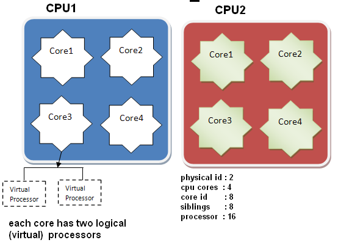

> 主机名修改
    
    hostname  # 查询主机名
    hostnamectl set-hostname <新主机名>
    reboot    # 重启

> 重启

    reboot

> 查看端口占用

    #查看所有端口
    netstat -aptn
    # 查看所有tcp协议端口
    netstat -ntpl
    #查看指定端口
    netstat -ap |grep -e 80 -e 8080
     
>查看服务状态

    service <服务名> status
    
> 安装rz sz命令

    apt-get install lrzsz

> 修改ssh端口
    
    # 将22端口修改
    sudo vi /etc/ssh/sshd_config
    
    #重启ssh服务
    service sshd restart
    
    #查看更改是否生效
    netstat -tlnp

> ssh 配置

    sudo vi /etc/ssh/sshd_config
    Port 22               //监听的端口号为22
    Protocol 2            //使用SSH V2协议
    ListenAdderss 0.0.0.0   //监听的地址为所有的地址
    UserDNS no         //禁止DNS反向解析
    PermitRootLogin no              // 禁止root用户登录
    PermitEmptyPasswords no    // 禁止空密码用户登录
    LoginGraceTime 2m             // 登录验证时间为2分钟
    MaxAuthTries 6                   //  最大重试次数6次
    AllowUsers steven               // 只允许steven用户登录
    DenyUsers steven               //  不允许登录用户 steven
    PasswordAuthentication  yes       //启用密码验证
    PubkeyAuthentication    yes         //启用密匙验证
    AuthorsizedKeysFile .ssh/authorized_keys  //指定公钥数据库文件
    #重启ssh服务
    service sshd restart

> 进程查看
    
    // 进程查看
    ps aux
    // 按内存排序
    ps aux --sort -rss
    // f 查看进程关系
    ps -ef
    
    // 查看启动程序所在路径
    ls -l /proc/{pid}

    // 查看cpu 最高的10个进程

    ps aux | sort -k3nr | head -n 10

    //查看内存 最高的10个进程

    ps aux | sort -k4nr | head -n 10

> 查看磁盘占用

    // 查看磁盘挂载详情
    fdisk -l    
    // 查看磁盘总占用
    df -h
    // 查看指定目录占用磁盘
    du -ah {目录}

    du -h --max-depth=1 {目录}
    
    # 删除文件 df -h 发现空间没有被释放，处理方案
    // 查看删除 仍然被占用的文件
    lsof | grep deleted
    // 杀掉进程释放  ### 注意该进程被杀掉的影响
    kill -9 pid

> 创建磁盘分区
    
    fdisk /dev/sdb
    # 格式化
    mkfs.ext4 /dev/sdb
    # 挂载
    vim /etc/fstab 
        /dev/sdb                /home/sdb               ext4    defaults        0 0
    mount -a
    # 卸载挂载
    umount /dev/sdb
> 查看并发
    
    netstat -antp | grep 80 | grep ESTABLSED -c

> 查看之前的命令
    
    history

>动态查看 cpu 内存
    
    top
    // 查看详细命令
    选项说明：
    	-d：指定top刷新的时间间隔，默认是3秒
    	-b：批处理模式，每次刷新分批显示
    	-n：指定top刷新几次就退出，可以配合-b使用
    	-p：指定监控的pid，指定方式为-pN1 -pN2 ...或-pN1, N2 [,...]
    	-u：指定要监控的用户的进程，可以是uid也可以是user_name
    
    常用快捷键：
    	1：(数字1)表示是否要在top的头部显示出多个cpu信息
    	H：表示是否要显示线程，默认不显示
    	c,S：c表示是否要展开进程的命令行，S表示显示的cpu时间是否是累积模式，cpu累积模式下已死去的子进程cpu时间会累积到父进程中
    	x,y：x高亮排序的列，y表示高亮running进程
    	u：指定需要显示的用户
    	n or #：设置要显示最大的进程数量（需要显示几个进程）
    	k：杀进程
    	q：退出top
    	P：以CPU 的使用资源排序显示
    	M：以Memory 的使用资源排序显示
    	N：以PID 来排序    

    %us：表示用户空间程序的cpu使用率（没有通过nice调度）

    %sy：表示系统空间的cpu使用率，主要是内核程序。
    
    %ni：表示用户空间且通过nice调度过的程序的cpu使用率。
    
    %id：空闲cpu
    
    %wa：cpu运行时在等待io的时间
    
    %hi：cpu处理硬中断的数量
    
    %si：cpu处理软中断的数量
    
    %st：被虚拟机偷走的cpu

> 软连接

    ln -s 源文件 目标文件

    -f : 链结时先将与 dist 同档名的档案删除
    -d : 允许系统管理者硬链结自己的目录
    -i : 在删除与 dist 同档名的档案时先进行询问
    -n : 在进行软连结时，将 dist 视为一般的档案
    -s : 进行软链结(symbolic link)
    -v : 在连结之前显示其档名
    -b : 将在链结时会被覆写或删除的档案进行备份
    -S SUFFIX : 将备份的档案都加上 SUFFIX 的字尾
    -V METHOD : 指定备份的方式
    --help : 显示辅助说明
    --version : 显示版本

> ls 命令

    # 只显示目录
    ls -F | grep "/$"
    # 只显示文件
    ls -al | grep "^-"

> rsync 文件同步

    rsync -av 源目录 目标目录
    
    -a：归档模式，相当于递归、保留权限等多个选项的组合
    -r：将数据递归（但不保存时间戳和权限，同时传输数据
    -v：显示同步过程详细信息
    -z：传输过程中启用压缩
    -A：保留文件的ACL属性信息
    -n：测试同步过程，不做实际修改
    –delete：删除目标文件夹内多余的文档
    -e: 协议

    # 远程同步
    rsync -ae ssh /home/data root@127.0.0.2:/home/data

> 文件句柄

    # 查看系统级的最大限制
    cat /proc/sys/fs/file-max
    # 查看用户级的限制
    ulimit -n
    # 临时修改文件句柄数
    ulimit -HSn 2048
    # 永久修改文件句柄数
    vi /etc/security/limits.conf

> cpu

    cat /proc/cpuinfo

    processor　：系统中逻辑处理核的编号。对于单核处理器，则课认为是其CPU编号，对于多核处理器则可以是物理核、或者使用超线程技术虚拟的逻辑核
    vendor_id　：CPU制造商     
    cpu family　：CPU产品系列代号
    model　　　：CPU属于其系列中的哪一代的代号
    model name：CPU属于的名字及其编号、标称主频
    stepping　  ：CPU属于制作更新版本
    cpu MHz　  ：CPU的实际使用主频
    cache size   ：CPU二级缓存大小
    physical id   ：单个CPU的标号
    siblings       ：逻辑处理器所处CPU 物理核总数
    core id        ：当前物理核在其所处CPU中的编号，这个编号不一定连续
    cpu cores    ：该逻辑处理器所处CPU的物理核数
    apicid          ：用来区分不同逻辑核的编号，系统中每个逻辑核的此编号必然不同，此编号不一定连续
    fpu             ：是否具有浮点运算单元（Floating Point Unit）
    fpu_exception  ：是否支持浮点计算异常
    cpuid level   ：执行cpuid指令前，eax寄存器中的值，根据不同的值cpuid指令会返回不同的内容
    wp             ：表明当前CPU是否在内核态支持对用户空间的写保护（Write Protection）
    flags          ：当前CPU支持的功能
    bogomips   ：在系统内核启动时粗略测算的CPU速度（Million Instructions Per Second）
    clflush size  ：每次刷新缓存的大小单位
    cache_alignment ：缓存地址对齐单位
    address sizes     ：可访问地址空间位数

> 系统参数 调优
>
    vim /etc/sysctl.conf
    # 表示开启重用。允许将TIME-WAIT sockets重新用于新的TCP连接，默认为0，表示关闭, 一般用于客户端；
    net.ipv4.tcp_tw_reuse=1
    # 表示开启TCP连接中TIME-WAIT sockets的快速回收，默认为0，表示关闭。 公网不宜使用
    net.ipv4.tcp_tw_recycle=1
    net.ipv4.tcp_timestamps=1

    net.ipv4.tcp_syncookies = 1 表示开启SYN Cookies。当出现SYN等待队列溢出时，启用cookies来处理，可防范少量SYN攻击，默认为0，表示关闭；
    net.ipv4.tcp_fin_timeout=30 修改系統默认的 TIMEOUT 时间
    net.ipv4.tcp_keepalive_time=1800 增加TCP SYN队列长度，使系统可以处理更多的并发连接。
    net.ipv4.tcp_max_syn_backlog=8192
    net.ipv4.ip_local_port_range=1024 65000 表示用于向外连接的端口范围。缺省情况下很小：32768到61000，改为1024到65000。
    net.ipv4.tcp_max_tw_buckets=5000 表示系统同时保持TIME_WAIT套接字的最大数量，如果超过这个数字，

    sysctl -p

>查看并发
> 
    netstat -n | awk '/^tcp/ {++S[$NF]} END {for(a in S) print a, S[a]}'

    CLOSED：无连接是活动的或正在进行
    LISTEN：服务器在等待进入呼叫
    SYN_RECV：一个连接请求已经到达，等待确认
    SYN_SENT：应用已经开始，打开一个连接
    ESTABLISHED：正常数据传输状态
    FIN_WAIT1：应用说它已经完成
    FIN_WAIT2：另一边已同意释放
    ITMED_WAIT：等待所有分组死掉
    CLOSING：两边同时尝试关闭
    TIME_WAIT：另一边已初始化一个释放
    LAST_ACK：等待所有分组死掉

[返回目录](../../README.md)