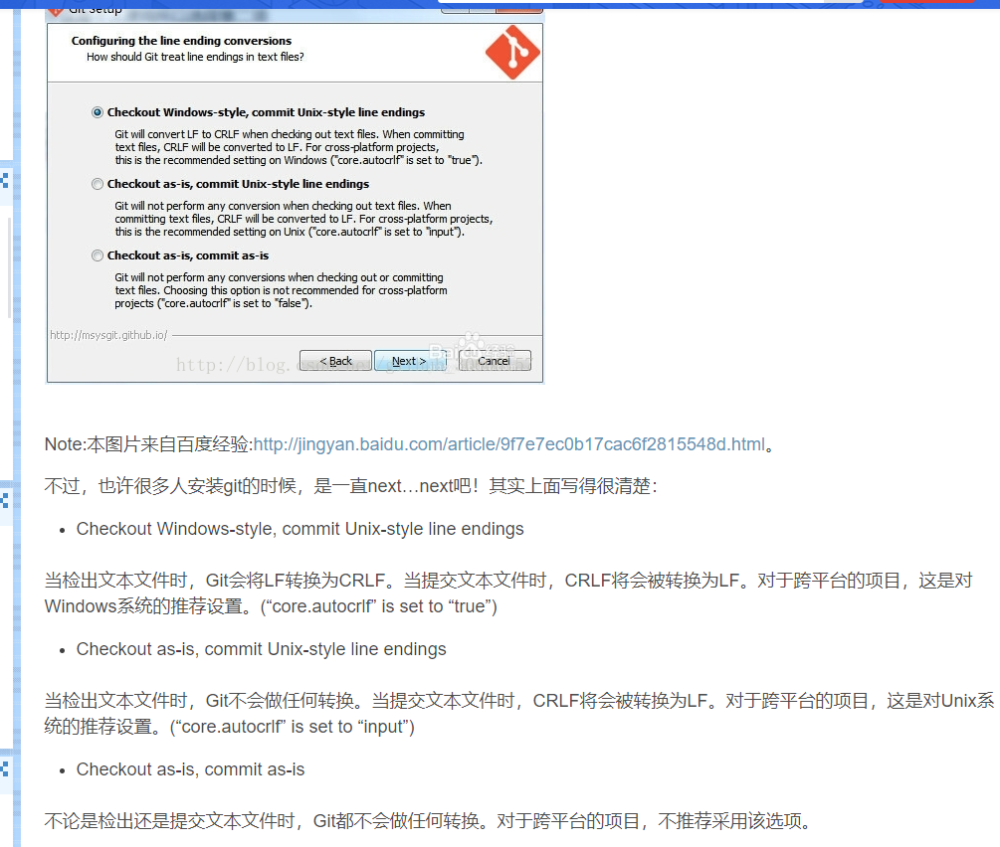

       查看系统config
       
       git config --system --list

       查看当前用户（global）配置
       
       git config --global  --list
        
       查看当前仓库配置信息
       
       git config --local  --list
   

    // 提交时转换为LF，检出时转换为CRLF
    git config --global core.autocrlf true   
    
    // 提交时转换为LF，检出时不转换
    git config --global core.autocrlf input   
    
    // 提交检出均不转换
    git config --global core.autocrlf false
    
    
    // 配置远程地址
    git remote add origin url
    
    // 删除远程地址
    git remote rm origin
    
    // 查看远程地址
    git remote -v
    
    

> windows 上安装 git 说明

    
> 修改作者

    // 设置全局 
    git config --global user.name "Author Name" 
    git config --global user.email "Author Email" 
    // 或者设置本地项目库配置 
    git config user.name "Author Name" 
    git config user.email "Author Email"

[返回目录](../README.md)